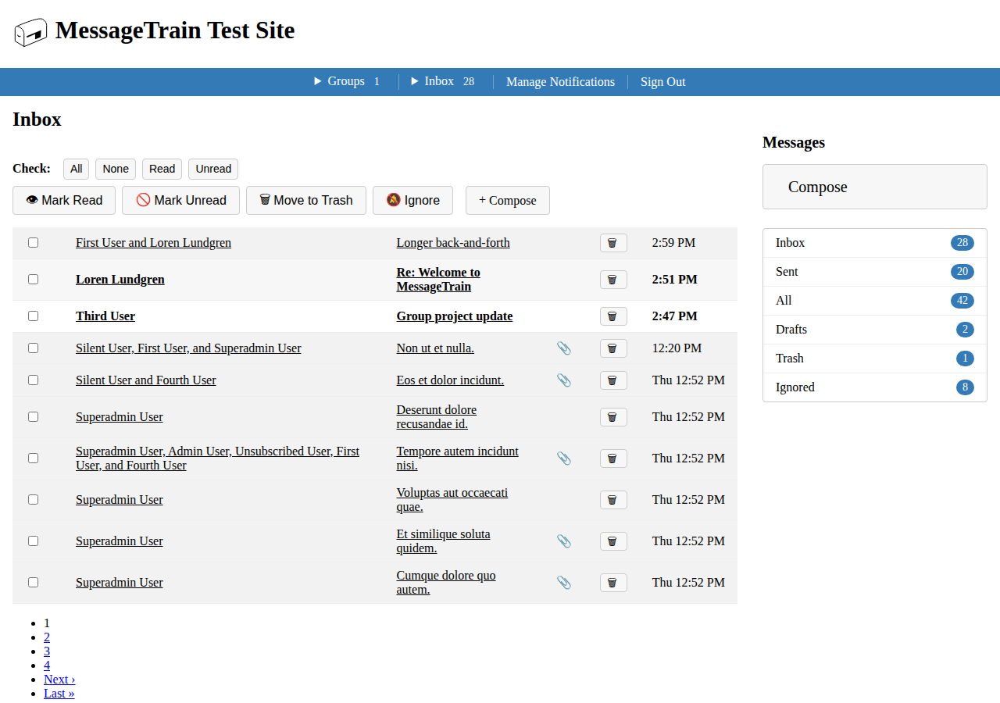
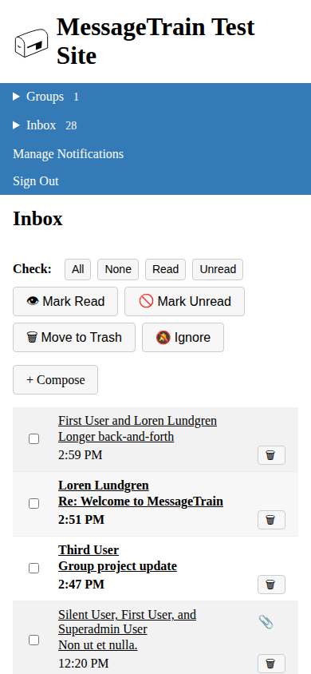

# MessageTrain
[](https://github.com/gemvein/message_train/actions/workflows/ci.yml)
[](https://rubygems.org/gems/message_train)
[](https://github.com/gemvein/message_train/actions/workflows/ci.yml)
[](http://opensource.org/licenses/MIT)

<!--
  MessageTrain ships real views/CSS/JS, so it's a candidate for these once
  each has a real automated check backing it - add whichever apply as that
  check is actually wired up and passing. Don't add a badge for a check
  that isn't actually running; an unbacked badge is worse than none. None
  of these checks exist yet as of 2026-08-28.

  [](#)
  [](#)
  [](#)
  [](#)
-->

MessageTrain is a Rails Engine for private messaging, built on Turbo
Frames and Stimulus, that lets users send and display private messages
to one another. It can also be configured to send messages to a user
collective (such as a certain Role or Group of users).

Messages can be saved as drafts instead of sending. Message composition
features type-ahead completion for recipients, markdown-formatted bodies,
and an arbitrary number of attachments. Messages are grouped together into
conversations, and allow valid senders to reply to a given message. Any given
conversation can be ignored if it is no longer of interest to the user, at
which point no further messages will be received in that conversation. The
'read' or 'unread' status of messages is tracked automatically, and can also
be changed manually by the user.

Conversations are grouped into various boxes, depending on their status for
that user: in, sent, all, drafts, trash, ignored. Any message can be trashed
by the user, at which point the user has the option to permanently delete it.

Email messages are sent when a user receives a message, either directly or
through a collective (unless they have unsubscribed from those notifications
or all notifications).

### Inbox Page
<p>
  
  
</p>

## Installation

MessageTrain is a normal Hotwire-based Rails 7.1+ app dependency - it
expects your host app already has `importmap-rails`, `turbo-rails`, and
`stimulus-rails` installed (their own install generators already run),
and is on Propshaft rather than Sprockets. It uses ActiveStorage for
attachments, so run its installer too if you haven't already:

```bash
bin/rails active_storage:install
```

**Watch the file-conflict prompt carefully** if your app has customized
`spec/spec_helper.rb` or `spec/rails_helper.rb` - answering (or missing)
the overwrite prompt wrong can silently replace your project's own spec
config. Diff after running the installer if you're not sure what
changed.

Message bodies are plain markdown text, rendered with `redcarpet` and
sanitized through Rails' own `sanitize` helper - no Action
Text/Trix dependency, and no separate install step needed for it.

Then add the gem and run the install generator:

```ruby
gem 'message_train'
```

```bash
rails g message_train:install
bin/rails db:migrate
```

The engine registers its own Stimulus controllers and importmap pins
automatically (via an engine initializer) - no manual pin-in wiring
needed in the host app.

Next, add to your models, each of which will need some kind of display
name column and some kind of slug (could be the same). See below for the
options for this mixin:

```ruby
# in /app/models/user.rb
message_train

# OR to set the name and slug columns:

message_train slug_column: :short_name, name_column: :display_name
```

To include Message Train variables and helpers in your controllers, add
this concern to your controller or application controller:

```ruby
include MessageTrainSupport
```

Add to your application.css (or application.scss, if you're using
dartsass-rails as message_train itself does):

```scss
@import 'message_train';
```

In your layout, supposing you use haml:

```haml
#alert_area
  - flash.each do |type, message|
    .alert{ class: flash_alert_class(type) }= message
```

If you'd like the built-in boxes dropdown/widget for navigation:

```haml
- if user_signed_in?
  = boxes_dropdown_list(current_user)
  = message_train_widget
```

### Required helper methods

If you don't use devise with its `current_user` method, you will need to
configure MessageTrain to use whatever method you use:

```ruby
MessageTrain.configure do |config|
  config.current_user_method = :current_subscriber
end
```

### Mixin options

The `message_train` mixin takes the following options:

<dl>
<dt>only</dt>
<dd>A symbol or array of symbols to be the only relationships used, which can include: [:sender, :recipient]</dd>
<dt>except</dt>
<dd>A symbol or array of symbols not to create relationships for, which can include: [:sender, :recipient]</dd>
<dt>valid_senders</dt>
<dd>A method name to call for a list of valid senders for this model</dd>
<dt>collectives_for_recipient</dt>
<dd>A method that, when passed @box_user, will return a collection of valid instances of this model for that @box_user to receive. Probably a scope. (e.g. it might return groups that the user is a member of)</dd>
<dt>valid_recipients</dt>
<dd>A method that returns a collection of valid recipients for this model. default: nil</dd>
<dt>name_column</dt>
<dd>The column by which to name and find this model. default: :name</dd>
<dt>slug_column</dt>
<dd>The column with the short, typeable form of the name. default: :slug</dd>
</dl>

### Smaller address book

By default, the address book will contain all objects of the
current_user_method object's model type. To change this behavior, define
an address book method on your recipient models, something like this:

```ruby
def self.valid_recipients_for(user)
    # Supposing you use rolify
    with_role(:friend, user)
end
```

And in your model:

```ruby
message_train address_book_method: :valid_recipients_for
```

Or in your initializer:

```ruby
config.address_book_methods[:users] = :valid_recipients_for
```

## View Helpers

### Boxes
<dl>
<dt>boxes_dropdown_list</dt>
<dd>Navigation dropdown list of boxes. (Be sure to check that user is signed in before calling, or you'll get errors.)</dd>
<dt>boxes_widget</dt>
<dd>Widget with list of boxes</dd>
<dt>box_nav_item(box)</dt>
<dd>List item for one box</dd>
<dt>box_list_item(box)</dt>
<dd>List item for one box</dd>
<dt>box_participant_name(participant)</dt>
<dd>Name of the participant, according to the method specified in yourconfiguration or model.</dd>
<dt>box_participant_slug(participant)</dt>
<dd>Slug of the participant, according to the method specified in your configuration or model.</dd>
</dl>

### Conversations
<dl>
<dt>conversation_senders(conversation)</dt>
<dd>List of senders for a given conversation</dd>
<dt>conversation_class(box, conversation)</dt>
<dd>CSS class to put on a given conversation when in a certain box</dd>
<dt>conversation_trashed_toggle(conversation)</dt>
<dd>Link to toggle trashed status of a conversation</dd>
<dt>conversation_read_toggle(conversation)</dt>
<dd>Link to toggle read status of a conversation</dd>
<dt>conversation_ignored_toggle(conversation)</dt>
<dd>Link to toggle ignored status of a conversation</dd>
<dt>conversation_deleted_toggle(conversation)</dt>
<dd>Link to toggle deleted status of a conversation</dd>
<dt>conversation_toggle(conversation, icon, mark_to_set, method, title, options = {})</dt>
<dd>Link to toggle some status of a conversation</dd>
</dl>

### Messages
<dl>
<dt>message_class(box, message)</dt>
<dd>CSS class to put on a given message when in a certain box</dd>
<dt>message_trashed_toggle(message)</dt>
<dd>Link to toggle trashed status of a message</dd>
<dt>message_read_toggle(message)</dt>
<dd>Link to toggle read status of a message</dd>
<dt>message_deleted_toggle(message)</dt>
<dd>Link to toggle ignored status of a message</dd>
<dt>message_toggle(message, icon, mark_to_set, title, options = {})</dt>
<dd>Link to toggle some status of a message</dd>
<dt>message_recipients(message)</dt>
<dd>Recipients for a given message</dd>
</dl>

## Configuration

<dl>
<dt>config.slug_columns</dt>
<dd>Usually populated by options on the `message_train` mixin for models, this contains a `Hash` of tables and their slug columns</dd>
<dt>config.name_columns</dt>
<dd>Usually populated by options on the `message_train` mixin for models, this contains a `Hash` of tables and their name columns</dd>
<dt>config.user_model</dt>
<dd>Defaults to `'User'`</dd>
<dt>config.current_user_method</dt>
<dd>Defaults to `Devise`'s `current_user`</dd>
<dt>config.user_sign_in_path</dt>
<dd>Defaults to `Devise`'s `/users/sign_in`</dd>
<dt>config.user_route_authentication_method</dt>
<dd>Defaults to `Devise`'s `:user`</dd>
<dt>config.address_book_method</dt>
<dd>Default value if `address_book_methods` doesn't have a match for thistable</dd>
<dt>config.address_book_methods</dt>
<dd>`Hash` of tables and the methods those tables use to provide atab-completion address book for that table.</dd>
<dt>config.recipient_tables</dt>
<dd>Usually populated by options on the `message_train` mixin for models,this contains a `Hash` of tables and their class names</dd>
<dt>config.collectives_for_recipient_methods</dt>
<dd>Usually populated by options on the `message_train` mixin for models,this contains a list of collectives that act as recipients through which users receive messages.</dd>
<dt>config.valid_senders_methods</dt>
<dd>Usually populated by options on the `message_train` mixin for models,this contains a `Hash` of tables and the methods that indicate which users can send messages to a given instance from that table.</dd>
<dt>config.valid_recipients_methods</dt>
<dd>Usually populated by options on the `message_train` mixin for models,this contains a `Hash` of tables and the methods that indicate which users can receive messages from a given instance from that table.</dd>
<dt>config.from_email</dt>
<dd>The email address from which notification emails are sent.</dd>
<dt>config.site_name</dt>
<dd>The name of the site, for use in notification emails.</dd>
</dl>

## Upgrading

### 1.0.0

This is a breaking change - see CHANGELOG.md for the full list. The
short version:

* Rails must be >= 7.1, < 9, and Ruby >= 3.2.
* Run `bin/rails active_storage:install` (if you haven't already) before
  running MessageTrain's own migrations. **There is no automated
  backfill for existing Paperclip-stored attachment data** - this
  version assumes a fresh attachments table. If you have real attachment
  data on 0.7.x in production, stay on 0.7.x until you've written your
  own backfill (walk your existing `public/system/...` files, attach
  each one via `ActiveStorage::Attached::One#attach`), or accept
  starting fresh.
* `Message#body` is now a plain markdown text column instead of a
  CKEditor-edited HTML column - rendered with `redcarpet` and sanitized
  through Rails' `sanitize` helper. If you were on a pre-1.0 build of
  this branch that used Action Text, there's no automated conversion
  from stored rich-text HTML to markdown source; either write your own
  conversion or start fresh.
* Bootstrap and jQuery are gone. If your host app's own layout/CSS
  assumed MessageTrain's views were Bootstrap markup, expect visual
  changes - views are now semantic HTML you can restyle directly.
* Your host app needs `importmap-rails`, `turbo-rails`, and
  `stimulus-rails` already installed (a normal Rails 7+ Hotwire app) and
  Propshaft instead of Sprockets.
* `alert_flash_messages` (a `bootstrap_leather` helper) no longer
  exists - render `flash` yourself in `#alert_area`, using the new
  `flash_alert_class(type)` helper to map Rails' flash keys to CSS
  classes. See the Installation section above.
* MessageTrain's CSS classes are now prefixed (`.icon` ->
  `.message-train-icon`, `.badge` -> `.message-train-badge`, etc.) so
  the engine's markup can't be reached by a host app's own broad
  selectors. If you styled MessageTrain by targeting the old
  unprefixed class names, update those selectors.
* The install generator's example route now mounts at `/messages`
  instead of `/` - only relevant if you re-run the generator or are
  copying its suggested route for a fresh install.

### 0.7.1

Renamed `subscription` to `message_train_subscription` and `subscriptions` to `message_train_subscription`.

### 0.4.0

Version 0.4.0 introduced database changes to the foreign key columns to
work with Rails 4.2.5. Let me know if you need help migrating your app to
the newly named foreign keys.

### 0.3.0

A new config variable was added for the user model, which will be used to
generate a new user if the user is anonymous.

### 0.2.0
New columns were added with version 0.2.0, so when upgrading be sure to
install the latest migrations:

```bash
rake message_train:install:migrations
```

Running this command is harmless if the migrations are already installed,
they will simply be skipped.

## Contributing to MessageTrain

*   Check out the latest master to make sure the feature hasn't been
    implemented or the bug hasn't been fixed yet.
*   Check out the issue tracker to make sure someone already hasn't
    requested it and/or contributed it.
*   Fork the project.
*   Start a feature/bugfix branch.
*   Commit and push until you are happy with your contribution.
*   Make sure to add tests for it. This is important so I don't break it
    in a future version unintentionally.
*   Please try not to mess with the Rakefile, version, or history. If you
    want to have your own version, or is otherwise necessary, that is
    fine, but please isolate to its own commit so I can cherry-pick around
    it.

## Contributors
*   [Loren Lundgren](https://github.com/nerakdon)
*   [Chad Lundgren](https://github.com/chadlundgren)

## Copyright

Copyright (c) 2015-2026 Gem Vein. See LICENSE.txt for further details.
